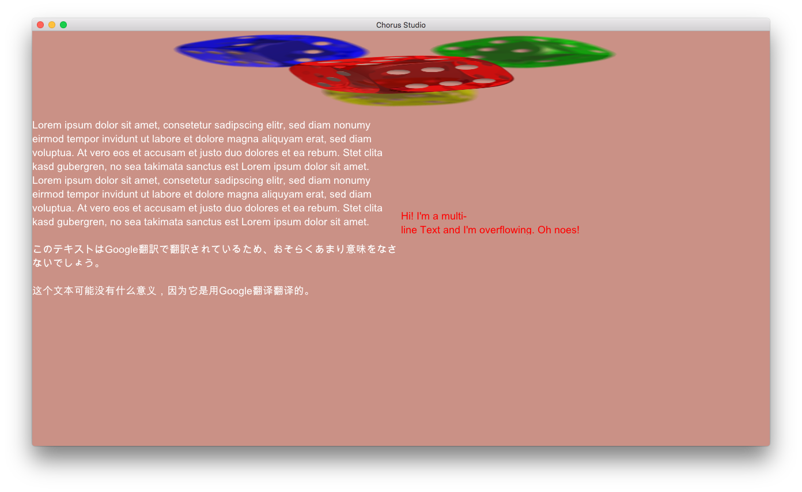

# Chorus Studio

**Heavily WIP**

---

Chorus Studio is aiming to be the world's *second* real-time collaborative DAW (digital audio workstation) and simultaneously trying to be the best!

The *second* real-time collaborative DAW? Yes! The first one ever created, at least to my knowledge, is [Ohm Studio](https://www.ohmstudio.com/). Chorus Studio is aiming to be an open source knock-off of Ohm Studio, except better in every way.

## Major features

- Plugin Support
  - VST3
  - AudioUnit
  - LV2
- Operating Systems
  - Windows 7 or higher
  - Linux
  - macOS

## Milestones

Here are plans for the milestones of the entire Chorus Studio project.

### Technical

1. **Ease of use**. Chorus Studio must not be overly difficult to handle or too hard to grok for users.
A clear and simple UI, well thought out features as well as good guides and tutorials are part of this milestone.
2. **Stability**. Chorus Studio must not crash, ever. It also must not soft-lock, ever. It should run so stable and smooth, that musicians can use it safely for live performance (concert) situations.
3. **Speed**. Chorus Studio must not be overly slow. A lightweight memory footprint is desirable.
4. **No glitches**. Chorus Studio must try to minimize all general glitches and bugs where possible.
Chorus Studio must rid itself of **all** audio glitches. Things like stuttering, cracking or desynchronization are a complete no-go!
5. **Processing beast**. Chorus Studio must be able to handle large chunks of data. Think really big projects with a ton of tracks and black midi.
6. **Platform compability**.
    - Chorus Studio must be able to load and export the most common audio file formats. The more formats the better.
    - Chorus Studio must be able host 64- and 32-bit VST3 plugins (Windows, Mac, Linux).
    - Chorus Studio must be able host 64-bit AudioUnit plugins (Mac).
    - Chorus Studio must be able host 64- and 32-bit LV2 plugins (Windows, Linux).
7. **Seamless networking**. For handling the online-collaborative part of Chorus Studio, a solid netcode is required. Server and client must never desynchronize. Multiple users must be able to work together at the same time within a project, without messing up each other's work.

... and more I can't think of right now.

### Community

A community consisting of musicians, composers and audio-engineers of all skill levels around Chorus Studio is desired. Communication channels need to be developed, such as:

1. A website for hosting and managing projects and user accounts, as well as providing a platform for users to show off their creations.
2. A forum for discussions and an outlet for seeking / providing talent.
3. A realtime chat built into the DAW and the website. Possibly IRC based.
4. A subreddit.

[Newgrounds](https://www.newgrounds.com/) is a great role model for this.

## How to run

As of now, I don't provide prebuilt binaries. If you want to try out Chorus Studio for yourself, you will have to build it from source. Continue reading if you want to do so.

Chorus Studio is written in the [Rust programming language](https://www.rust-lang.org), so a working Rust installation is required. Such can be installed easily with [rustup.rs](https://rustup.rs/).

Then, once you have a working Rust installation, download or clone this repository onto your machine. Navigate a terminal inside the new chorus_studio directory and run the command `cargo run`. This will download and build all libraries Chorus Studio depends on and if building everything succeeded, will run the program.