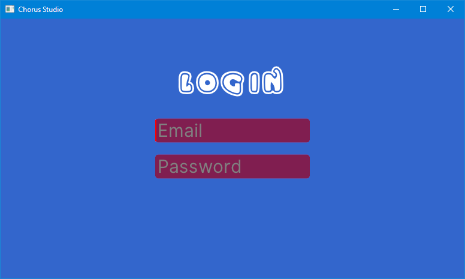

Chorus Studio
===

This is what Chorus Studio currently looks like, if you were to run it.

---

Chorus Studio is aiming to be the world's *second* real-time collaborative DAW (digital audio workstation), while at the same time trying to be the best!

The first being [Ohm Studio](https://www.ohmstudio.com/). Indeed, Chorus Studio tries to copy all the good parts and improve upon the bad parts of Ohm Studio.

## What? Why?

Chorus Studio was thought into existence by Daniel Hauser ([@lisoph](https://github.com/Lisoph), me). After using Ohm Studio for about a year, I grew tired of it constantly breaking, being glitchy, crashing and seemingly getting buggier with time. Every update only seemed to worsen the situation by introducing new major bugs or by making already existing bugs worse. It has come to a point where I would generally recommend avoiding Ohm Studio to new users, due to it's bugs and instability.

The community seems to reflect this, since the userbase hasn't seen any real growth in a long time.

After contacting the developers of Ohm Studio (Ohm Force) and being turned down on becoming a helping hand for free, I decided to roll my own clone of Ohm Studio. It seemed like the only solution to keep the amazing concept of Ohm Studio from dying out.

Basically, Chorus Studio tries to be a direct competitor to Ohm Studio.

## Milestones

Here are plans for the milestones of the entire Chorus Studio project.

### Technical

1. **Ease of use**. Chorus Studio must not be overly difficult to handle or too hard to grok for users.
A clear and simple UI, well thought out features as well as good guides and tutorials are part of this milestone.
2. **Stability**. Chorus Studio must not crash, ever. It also must not soft-lock, ever. It should run so stable and smooth, that musicians can use it safely for live performance (concert) situations.
3. **Speed**. Chorus Studio must not be overly slow. A lightweight memory footprint is desirable.
4. **No glitches**. Chorus Studio must try to minimize all general glitches where possible.
Chorus Studio must also rid itself of **all** audio glitches. Things like stuttering, cracking or desynchronization are a complete no-go!
5. **Processing beast**. Chorus Studio must be able to handle large chunks of data. Think really big projects with a ton of tracks and black midi.
6. **Compability**.
    - Chorus Studio must be able to load and export the most common audio file formats. The more formats the better.
    - Chorus Studio must be able host 64- and 32-bit VST plugins. More plugin formats, such as LV2, are desirable.
7. **Solid networking**. For handling the online-collaborative part of Chorus Studio, a solid netcode is required. Server and client must never desynchronize. Multiple users must be able to work together at the same time within a project, without messing up each other's work.

... and more I can't think of right now.

### Community

Chorus Studio should try to build a strong community consisting of musicians, writers and engineers of all skill levels. For this to work, the following components are necessary:

1. A website for hosting and managing projects and user accounts, as well as providing a platform for users to show off their creations.
2. A forum for discussions and an outlet for seeking / providing talent.
3. A realtime chat built into the DAW and the website. Possibly IRC based.
4. A subreddit.

[Newgrounds](https://www.newgrounds.com/) is a great role model for this.

## How to run

As of now, we don't provide prebuilt binaries. If you want to try out Chorus Studio for yourself, you will have to build it from source. Continue reading if you want to do so.

Chorus Studio is written in the [Rust programming language](https://www.rust-lang.org), so a working Rust installation is required. Such can be installed easily with [rustup.rs](https://rustup.rs/).

Then, once you have a working Rust installation, download or clone this repository onto your machine. Navigate a terminal inside the new chorus_studio directory and run the command `cargo run`. This will download and build all libraries Chorus Studio depends on and if building everything succeeded, will run the program.

---

This README is a draft and is not final.